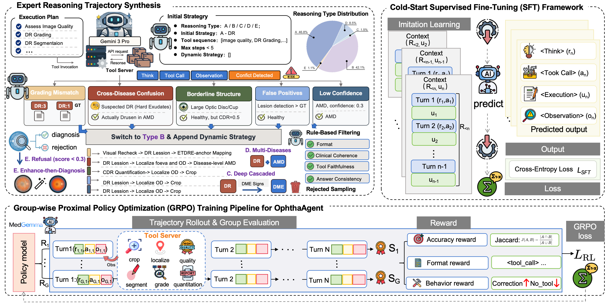

# OphthaAgent

<p align="left">
  
  
  
  
  
</p>

Agentic multi-modal reasoning for comprehensive fundus diagnosis.

<p align="center">
  
</p>
<p align="center">
  <em>Training pipeline of OphthaAgent (expert trajectory synthesis, cold-start SFT, and GRPO-based RL).</em>
</p>

This repository is an anonymized and cleaned **partial open-source release**, focused on the toolchain and decision pipeline.

## Highlights

- Multi-turn `reason -> tool_call -> observation -> refine` diagnostic loop
- Reflection mechanism to mitigate tool-induced hallucinations
- Specialized fundus toolkit (11 heterogeneous vision tools)
- Two-stage training pipeline (Cold-start SFT + Agentic RL with GRPO)
- Strong benchmark performance with compact model size

## Table of Contents

- [System Overview](#system-overview)
- [Method at a Glance](#method-at-a-glance)
- [Results Snapshot](#results-snapshot)
- [Open-Source Scope](#open-source-scope)
- [Repository Layout](#repository-layout)
- [Quick Start](#quick-start)
- [Roadmap](#roadmap)
- [Citation](#citation)
- [License](#license)

## System Overview

Given fundus image `I` and query `Q`, OphthaAgent performs multi-turn interactive reasoning with tool integration.

- Tool observations are treated as **fallible intermediate evidence**, not absolute truth.
- When confidence is low or evidence is inconsistent, a reflection mechanism is triggered.
- The agent verifies with intrinsic visual reasoning and fine-grained specialist tools before producing final answer `y`.

Target diseases include:

- Diabetic Retinopathy (DR)
- Age-related Macular Degeneration (AMD)
- Diabetic Macular Edema (DME)
- Glaucoma

## Method at a Glance

### 1) Specialized Fundus Toolkit

OphthaAgent integrates 11 vision tools across three granularities:

- Disease-level prediction: DR grading, DME risk, AMD detection
- Lesion-level analysis: segmentation and quantitative lesion statistics
- Anatomy-level analysis: vessel / optic disc-cup / fovea segmentation with ETDRS-aware mapping

Additional quality assessment/enhancement and ROI cropping improve robustness on low-quality inputs.

### 2) Two-Stage Training

- **Stage 1: Cold-start SFT**
  - Learn multi-turn tool use boundaries and recovery behavior from clinically aligned trajectories
- **Stage 2: Agentic RL (GRPO)**
  - Optimize policy with trajectory rewards and KL regularization under real-time tool execution

### 3) Composite Reward

- `R_format`: output structure compliance
- `R_acc`: prediction-ground-truth consistency
- `R_behavior`: process-level behavioral supervision (incl. dynamic LLM-as-a-Judge)

## Results Snapshot

On two fundus benchmarks, OphthaAgent shows consistent improvements over strong medical/domain baselines while maintaining a compact model size.

- Benchmark 1 overall score: **73.57%** (4B)
- ID S-MCQ accuracy: **80.33%**
- OOD M-MCQ precision: **81.08%**

For full protocols, ablations, and detailed comparisons, please refer to the paper.

## Open-Source Scope

This release currently includes:

- `ophthaagent-toolkit/`: core pipeline, tool integration, and execution scripts
- `assets/system_overview.png`: project figure

Large private assets/checkpoints and non-public components are intentionally excluded.

## Repository Layout

```text
.
├── README.md
├── assets/
│   └── system_overview.png
└── ophthaagent-toolkit/
    ├── agents/
    ├── generator/
    ├── fundus_decision.py
    ├── run_vqa.py
    ├── batch_run_vqa.py
    ├── requirements.txt
    └── ...
```

## Quick Start

```bash
cd ophthaagent-toolkit
python -m venv .venv
source .venv/bin/activate
pip install -r requirements.txt
```

```bash
# Main entrypoints
python run_vqa.py --help
python batch_run_vqa.py --help

# Optional: generator pipeline
cd generator
python main_v2.py --help
```

## Roadmap

- [x] Core tool-integrated inference pipeline release
- [x] Anonymized project packaging for public sharing
- [ ] Full training/evaluation scripts cleanup for one-command reproduction
- [ ] Public benchmark result cards and checkpoints (if policy permits)

## Citation

If you find this project useful, please cite:

```bibtex
@article{ophthaagent,
  title   = {OphthaAgent: Tool-Augmented Agentic Reasoning for Fundus Diagnosis},
  author  = {Anonymous},
  journal = {Under review},
  year    = {2026}
}
```

## License

This repository follows the license in `ophthaagent-toolkit/LICENSE`.
